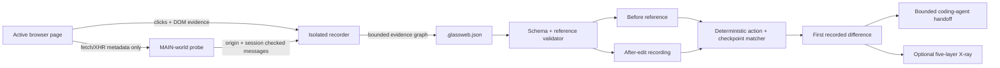

<p align="center">
  
</p>

<h1 align="center">GlassWeb</h1>

<p align="center"><strong>Click one thing. Get one plain answer about what your website did next.</strong></p>

<p align="center">
  <a href="https://github.com/zaiqltd/glassweb/actions/workflows/ci.yml"></a>
  
  
  
</p>

GlassWeb is a local-first website explainer for people who build with Cursor, Claude, Codex, and other coding AIs:

> **Your button worked. The problem appeared when checkout started.**

Do one confusing thing on a website—a button click, form submission, or checkout attempt. GlassWeb follows what the browser saw next, turns it into a short human explanation, and prepares a bounded note you can paste into your coding AI.

The first screen is a safe interactive example. Click **Start Pro** and GlassWeb reveals only three steps:

```text
You clicked  →  The website tried checkout  →  Checkout returned an error
```

No account. Nothing uploaded. No DevTools vocabulary. Exact browser details and the full five-layer inspection exist, but only appear when someone deliberately asks for them.

No city metaphor. No force-directed spaghetti. No AI filling gaps with fiction.

<p align="center"><a href="https://glassweb.cae1.chatgpt.site/"><strong>Try the live demo — no sign-in →</strong></a></p>

## See the magic trick

Requires Node.js 22.13 or newer.

```bash
npm install
npm run demo
```

Open [http://localhost:3000](http://localhost:3000), then:

1. Click **Start Pro** in the fake website.
2. Watch GlassWeb follow the click in three plain steps.
3. Read the answer: the button worked; the problem appeared when checkout started.
4. Choose **Try it on my website** only when you are ready to use the Chrome extension.

The example is deterministic and offline. It needs no account, API key, model provider, or captured browsing data.

## What is working today

| Surface                   | What a normal person gets                                                             | Status   |
| ------------------------- | ------------------------------------------------------------------------------------- | -------- |
| Click-it-yourself example | Learns what GlassWeb does by using it, with no setup or sign-in                       | Default  |
| Single-action answer      | One plain answer and a short visual path for the thing they just did                  | Working  |
| Safe coding-AI handoff    | A bounded, ready-to-paste note that separates what was seen from what remains unknown | Working  |
| Before/after edit check   | Finds the first meaningful change when the same action is saved twice                 | Working  |
| Exact browser details     | Reveals request, status, certainty, and matching details only on demand               | Optional |
| Five-layer advanced view  | Keeps the full browser-visible inspection for people who need it                      | Optional |
| Chrome extension          | Watches one active page with minimal permissions and safe defaults                    | Alpha    |

GlassWeb does not claim server-side causality it cannot see. In a normal capture, the recorder can prove that an interaction happened and that a request happened nearby. Without a reliable initiator stack, their edge is **correlated**, never silently promoted to **observed**.

## Try it on your own website

Build the downloadable recorder:

```bash
npm run package:recorder
```

For local development, open `chrome://extensions`, enable **Developer mode**, choose **Load unpacked**, and select the repository’s `extension/` folder.

Then explain one action:

1. Open the website in desktop Chrome.
2. Open GlassWeb Recorder and choose **Start watching**.
3. Do the one thing you want explained: begin checkout, submit a lead form, or save a setting.
4. Stop and save the recording.
5. In GlassWeb choose **Try it on my website**, then **Open my GlassWeb file**.
6. Read the plain answer or copy it to your coding AI.

The before/after checker remains available for planned regression checks: save the important action while it works, make the edit, then save the same action again. GlassWeb keeps uncertain matches and incomplete captures explicit instead of manufacturing a confident answer.

The extension asks for `activeTab`, `scripting`, `storage`, and `downloads` only. There is no `<all_urls>` access and no debugger permission.

Screenshots are off by default because pixels can contain private information. If enabled, only the currently visible tab area is attached.

## When you open Full X-ray

### The five layers

| Layer         | Plain-language question                 | Typical evidence                                  |
| ------------- | --------------------------------------- | ------------------------------------------------- |
| **Visible**   | What did the person see or touch?       | Bounds, label, click target                       |
| **Structure** | What document node sits behind it?      | Tag, safe selector, DOM mutation                  |
| **Behaviour** | What browser-side action responded?     | Event type, instrumented handler boundary         |
| **Network**   | What left or returned to the browser?   | Method, redacted route, status, MIME type, timing |
| **Service**   | Which first or third party received it? | Request origin and same-origin classification     |

### Certainty is part of the interface

| State          | Meaning                                                                 |
| -------------- | ----------------------------------------------------------------------- |
| **Observed**   | Direct browser evidence supports this fact or connection                |
| **Correlated** | Multiple observations align in time, but exact causality is not exposed |
| **Inferred**   | A named rule or model produced the claim                                |
| **Unknown**    | The browser cannot see enough to make the connection honestly           |

Every entity and relation in a valid trace must reference an evidence record. The importer rejects dangling evidence and graph IDs that were never captured.

## Privacy model

GlassWeb records an allowlisted metadata envelope. The recorder does **not read**:

- form or input values;
- cookie values;
- authorization and arbitrary request/response headers (only the MIME content type may be retained);
- request or response bodies;
- storage contents.

The request probe necessarily receives the URL used by the page, then removes query values and fragments before adding it to the recording. They are never retained in the exported trace.

Labels are length-bounded and scrubbed for common email, phone-like, and token-shaped strings before storage. Export shows the active redaction policy before download. Nothing is uploaded by this repository.

Captured metadata can still be sensitive. Review every trace before publishing it. See [SECURITY.md](./SECURITY.md) for the threat model.

## Architecture



The recorder and viewer share a versioned graph vocabulary, but both recordings and checks are portable JSON. Comparison is deterministic and local. The page is never contacted during replay.

## Repository map

```text
app/                         Vinext application entry and global visual system
components/glassweb/         X-ray, page surface, runtime, dialogs, workbench
lib/glassweb/                Versioned types, validator, queries, canonical trace
extension/                   Minimal-permission Chrome MV3 recorder
public/                      Social card, recorder archive, portable demo trace
scripts/                     Packaging, demo export, and credential scan
tests/                       Schema, evidence, permissions, and privacy invariants
docs/TRACE-FORMAT.md         GlassWeb trace v1 reference
```

## Honest limitations

- Comparison is manual today: GlassWeb does not yet run the action automatically after a deploy.
- Capture currently covers one page. If navigation occurs, GlassWeb tries to preserve a recoverable partial recording; if the browser ends the page too quickly, it says to start again instead of claiming the capture survived.
- Stop waits for action-related requests to finish for up to ten seconds. If one is still in flight, the recording is marked partial instead of claiming that request disappeared.
- An absent step is called **missing** only when both captures declare themselves complete. Otherwise it is **not recorded**.
- Stable browser-visible identities can still be ambiguous. GlassWeb asks the user to pair actions instead of guessing.
- `fetch`, XHR, resource timing, clicks, submits, changes, and DOM mutations are covered. WebSocket, EventSource, service-worker, and CDP initiators are not yet captured.
- Cross-origin iframes and closed shadow roots remain opaque.
- A hostile page can interfere with MAIN-world instrumentation. GlassWeb traces are explanation artifacts, not forensic security logs.
- Generic captures identify browser-visible interaction boundaries, not framework-perfect React/Vue component names.
- Timing correlation cannot prove which application function caused a request.

These gaps appear as **correlated** or **unknown** evidence. They are not hidden behind confident prose.

## Roadmap

- **Deploy hooks** — run saved checks after GitHub, Vercel, and Netlify deploys.
- **Hosted check history** — retain successful and failed runs, alerts, and client-ready proof.
- **Cross-navigation capture** — preserve a complete journey through same-origin page changes.
- **Source-map bridge** — connect browser behaviour to named source functions when maps exist.
- **AI Search lens** — compare raw server HTML with the rendered interface.
- **Optional CDP adapter** — add initiator stacks and frame identity behind explicit permission.
- **Framework and service recognizers** — translate more raw identities into useful human labels.
- **GhostRun** — safely replay a saved journey against a changed build and verify repair.

## Contributing

The best first contributions make one confusing browser fact understandable without weakening the evidence model. Service recognizers, safe framework labels, query intents, hostile-page fixtures, and trace examples are especially welcome.

Read [CONTRIBUTING.md](./CONTRIBUTING.md), the [trace format](./docs/TRACE-FORMAT.md), and [SECURITY.md](./SECURITY.md) before changing capture behaviour.

The visual contract lives in [docs/DESIGN-PRINCIPLES.md](./docs/DESIGN-PRINCIPLES.md).

## Verification

```bash
npm run typecheck
npm run lint
npm test
npm run scan:secrets
npm run build
```

The release suite validates the canonical graph, rejects unsafe imports, checks Chrome permissions, tests privacy invariants, parses every extension script, and scans credential-shaped values.

## License

Apache-2.0. See [LICENSE](./LICENSE).
