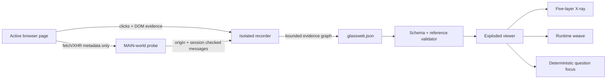

<p align="center">
  
</p>

<h1 align="center">GlassWeb</h1>

<p align="center"><strong>Click any interface. Unfold the browser-visible system that made it happen.</strong></p>

<p align="center">
  
  
  
</p>

GlassWeb is an evidence-native X-ray for websites. Pick a price, button, form, or visible outcome and the page separates into five aligned layers:

```text
Visible  →  Structure  →  Behaviour  →  Network  →  Service
```

The result has the technical depth of DevTools, but it reads like a story. Human meaning comes first, raw identity stays one level below it, and every connection says how certain it really is.

No city metaphor. No force-directed spaghetti. No AI filling gaps with fiction.

## See the magic trick

Requires Node.js 22.13 or newer.

```bash
npm install
npm run demo
```

Open [http://localhost:3000](http://localhost:3000), then:

1. Click **Play tour** for the 30-second guided trace.
2. Select the regional price or **Start Pro** inside the page.
3. Move between **Trace**, **AI view**, and **Runtime**.
4. Ask “Where does this price come from?” in the bottom bar.
5. Inspect an entity to see the evidence and certainty behind it.

The bundled Orbit pricing session is deterministic and offline. It needs no account, API key, model provider, or captured browsing data.

## What is working today

| Surface            | What it does                                                                  | Status                        |
| ------------------ | ----------------------------------------------------------------------------- | ----------------------------- |
| Exploded X-ray     | Keeps the real page visually anchored while technical layers unfold beside it | Working                       |
| Evidence focus     | Dims unrelated objects and reveals one outcome-to-service path                | Working                       |
| Runtime weave      | Replays clicks, mutations, requests, responses, and services on aligned lanes | Working                       |
| AI visibility lens | Shows what disappears when content requires client JavaScript                 | Working in the canonical demo |
| Ask bar            | Maps natural-language intents to entities already present in the trace        | Deterministic; no model calls |
| Portable traces    | Validates, imports, replays, redacts, and exports `.glassweb.json` files      | Working                       |
| Chrome recorder    | Captures one active page with minimal permissions and safe metadata defaults  | Alpha                         |

GlassWeb does not claim server-side causality it cannot see. In a normal capture, the recorder can prove that an interaction happened and that a request happened nearby. Without a reliable initiator stack, their edge is **correlated**, never silently promoted to **observed**.

## Capture a real page

Build the downloadable recorder:

```bash
npm run package:recorder
```

For local development, open `chrome://extensions`, enable **Developer mode**, choose **Load unpacked**, and select the repository’s `extension/` folder.

Then:

1. Open a normal HTTP or HTTPS page.
2. Open GlassWeb Recorder and choose **Start capture**.
3. Use the page normally. Click the outcome you want to understand.
4. Open the recorder again and choose **Stop and export trace**.
5. Drop the exported `.glassweb.json` file into the GlassWeb viewer with **Import**.

The extension asks for `activeTab`, `scripting`, `storage`, and `downloads` only. There is no `<all_urls>` access and no debugger permission.

Screenshots are off by default because pixels can contain private information. If enabled, only the currently visible tab area is attached.

## How to read GlassWeb

### The five layers

| Layer         | Plain-language question                 | Typical evidence                                  |
| ------------- | --------------------------------------- | ------------------------------------------------- |
| **Visible**   | What did the person see or touch?       | Bounds, label, click target                       |
| **Structure** | What document node sits behind it?      | Tag, safe selector, DOM mutation                  |
| **Behaviour** | What browser-side action responded?     | Event type, instrumented handler boundary         |
| **Network**   | What left or returned to the browser?   | Method, redacted route, status, MIME type, timing |
| **Service**   | Which first or third party received it? | Request origin and same-origin classification     |

### Certainty is part of the interface

| State          | Meaning                                                                 |
| -------------- | ----------------------------------------------------------------------- |
| **Observed**   | Direct browser evidence supports this fact or connection                |
| **Correlated** | Multiple observations align in time, but exact causality is not exposed |
| **Inferred**   | A named rule or model produced the claim                                |
| **Unknown**    | The browser cannot see enough to make the connection honestly           |

Every entity and relation in a valid trace must reference an evidence record. The importer rejects dangling evidence and graph IDs that were never captured.

## Privacy model

GlassWeb records an allowlisted metadata envelope. The recorder does **not read**:

- form or input values;
- cookie values;
- authorization and arbitrary request/response headers (only the MIME content type may be retained);
- request or response bodies;
- storage contents; or
- URL query values and fragments.

Labels are length-bounded and scrubbed for common email, phone-like, and token-shaped strings before storage. Export shows the active redaction policy before download. Nothing is uploaded by this repository.

Captured metadata can still be sensitive. Review every trace before publishing it. See [SECURITY.md](./SECURITY.md) for the threat model.

## Architecture



The recorder and viewer share a versioned graph vocabulary, but the exported trace is just portable JSON. The page is never contacted during replay.

## Repository map

```text
app/                         Vinext application entry and global visual system
components/glassweb/         X-ray, page surface, runtime, dialogs, workbench
lib/glassweb/                Versioned types, validator, queries, canonical trace
extension/                   Minimal-permission Chrome MV3 recorder
public/                      Social card, recorder archive, portable demo trace
scripts/                     Packaging, demo export, and credential scan
tests/                       Schema, evidence, permissions, and privacy invariants
docs/TRACE-FORMAT.md         GlassWeb trace v1 reference
```

## Honest limitations

- Capture currently covers one page until navigation; a navigation ends the active session.
- `fetch`, XHR, resource timing, clicks, submits, changes, and DOM mutations are covered. WebSocket, EventSource, service-worker, and CDP initiators are not yet captured.
- Cross-origin iframes and closed shadow roots remain opaque.
- A hostile page can interfere with MAIN-world instrumentation. GlassWeb traces are explanation artifacts, not forensic security logs.
- Generic captures identify browser-visible interaction boundaries, not framework-perfect React/Vue component names.
- Timing correlation cannot prove which application function caused a request.

These gaps appear as **correlated** or **unknown** evidence. They are not hidden behind confident prose.

## Roadmap

- **Compare mode** — put two traces side by side and isolate what changed.
- **Source-map bridge** — connect browser behaviour to named source functions when maps exist.
- **AI Search lens** — compare raw server HTML with the rendered interface.
- **Optional CDP adapter** — add initiator stacks and frame identity behind explicit permission.
- **Framework and service recognizers** — translate more raw identities into useful human labels.
- **GhostRun** — replay a journey against a changed build and surface broken causal paths.

## Contributing

The best first contributions make one confusing browser fact understandable without weakening the evidence model. Service recognizers, safe framework labels, query intents, hostile-page fixtures, and trace examples are especially welcome.

Read [CONTRIBUTING.md](./CONTRIBUTING.md), the [trace format](./docs/TRACE-FORMAT.md), and [SECURITY.md](./SECURITY.md) before changing capture behaviour.

The visual contract lives in [docs/DESIGN-PRINCIPLES.md](./docs/DESIGN-PRINCIPLES.md).

## Verification

```bash
npm run typecheck
npm run lint
npm test
npm run scan:secrets
npm run build
```

The release suite validates the canonical graph, rejects unsafe imports, checks Chrome permissions, tests privacy invariants, parses every extension script, and scans credential-shaped values.

## License

Apache-2.0. See [LICENSE](./LICENSE).
